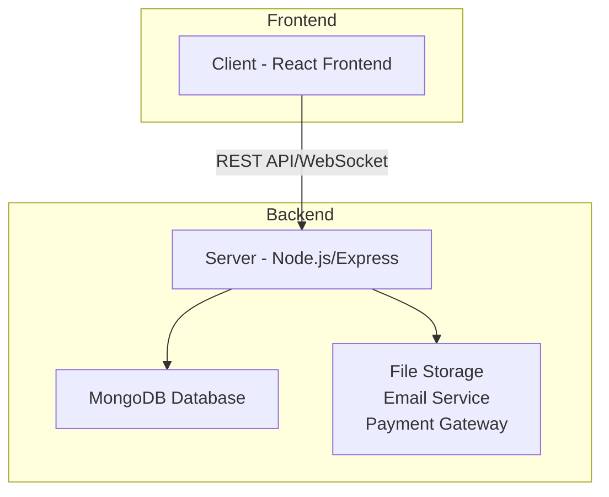
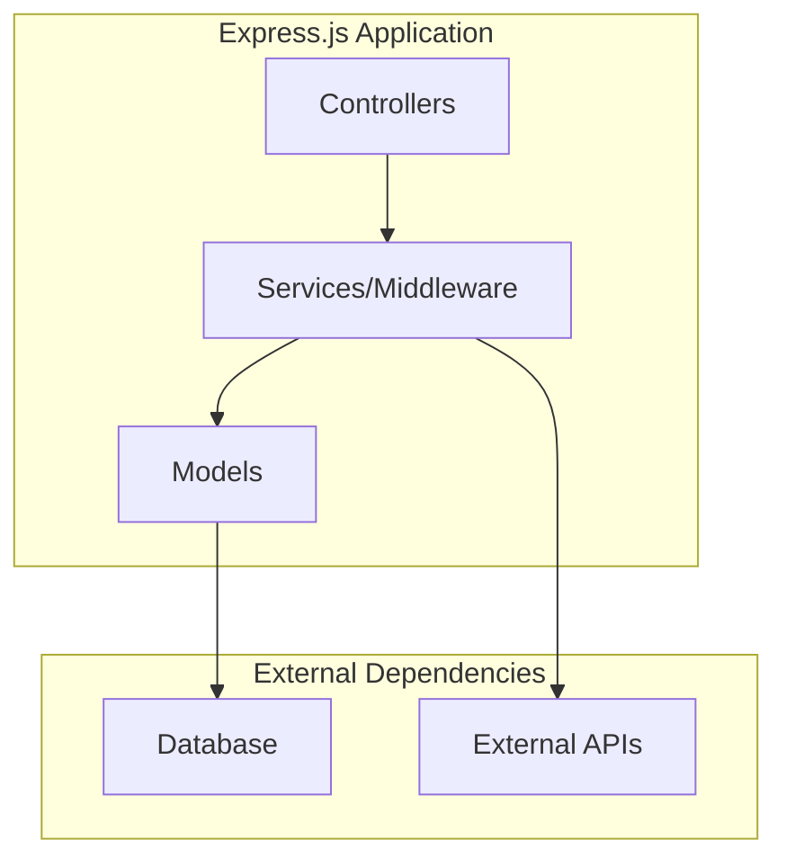
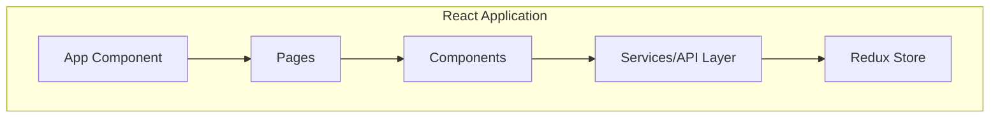
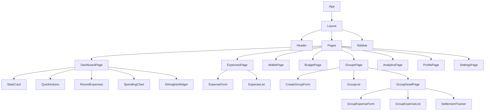

# Expensiver - Full-Stack Expense Management Application

## 1. Overview

Expensiver is a comprehensive expense management application that allows users to track personal and group expenses, manage budgets, and collaborate with others on shared financial responsibilities. The application features a modern React frontend with a Node.js/Express backend, utilizing MongoDB for data storage.

The system provides core functionality for:
- Personal expense tracking with categorization and tagging
- Group expense management with split calculations
- Real-time notifications and chat functionality
- Budget planning and analytics
- AI-powered expense insights and categorization
- Secure authentication and authorization

## 2. Architecture

The application follows a client-server architecture with a clear separation between frontend and backend components.

### 2.1 High-Level Architecture

### 2.2 Backend Architecture

The backend follows a layered architecture with clear separation of concerns:

### 2.3 Frontend Architecture

The frontend uses a component-based architecture with Redux for state management:

## 3. Data Models

### 3.1 User Model

The User model represents application users with comprehensive profile information, authentication details, and preferences:

- **Basic Information**: name, email, username, phone
- **Authentication**: password (hashed), password reset tokens, email verification
- **Profile**: avatar, date of birth, gender, occupation, bio, address
- **Account Settings**: role, account status, preferences (currency, language, theme)
- **Financial Settings**: default budget, category limits
- **Security**: login attempts, two-factor authentication, security events
- **Statistics**: total expenses, total spent, groups joined
- **Relationships**: groups membership

### 3.2 Expense Model

The Expense model tracks both personal and group expenses with rich metadata:

- **Basic Information**: title, description, amount, currency
- **Categorization**: category, subcategory, tags
- **Temporal Data**: date, due date
- **Location**: geolocation data
- **Payment**: payment method, payment details
- **Relationships**: user, group (for group expenses)
- **Split Information**: split type, split details for group expenses
- **Recurring**: recurring pattern for periodic expenses
- **Media**: receipts and images
- **Workflow**: status, approval information
- **Settlement**: settlement tracking
- **AI Integration**: AI categorization, insights
- **Notifications**: reminder system
- **Comments**: discussion thread on expenses

### 3.3 Group Model

The Group model manages shared expense groups with collaborative features:

- **Basic Information**: name, description, group code
- **Visual Identity**: avatar, cover image, color scheme
- **Membership**: creator, admins, members with roles and permissions
- **Settings**: privacy, currency, expense policies
- **Financials**: categories, budgets, balances
- **Invitations**: invitation system with tokens
- **Activity**: expense tracking, settlement history
- **Communication**: notification preferences

## 4. API Endpoints

### 4.1 Authentication Routes

- `POST /api/auth/register` - User registration
- `POST /api/auth/login` - User login
- `POST /api/auth/logout` - User logout
- `POST /api/auth/forgot-password` - Password reset request
- `POST /api/auth/reset-password/:token` - Password reset
- `GET /api/auth/me` - Get current user profile
- `PUT /api/auth/me` - Update user profile

### 4.2 Expense Routes

- `GET /api/expenses` - Get all expenses for user (with filtering)
- `GET /api/expenses/:id` - Get specific expense
- `POST /api/expenses` - Create new expense
- `PUT /api/expenses/:id` - Update expense
- `DELETE /api/expenses/:id` - Delete expense
- `GET /api/expenses/categories` - Get expense categories with statistics
- `GET /api/expenses/stats` - Get expense statistics
- `POST /api/expenses/:id/comments` - Add comment to expense
- `PUT /api/expenses/:id/split-payment` - Update split payment status
- `GET /api/expenses/recurring` - Get recurring expenses
- `POST /api/expenses/:id/generate-recurring` - Generate next recurring expense
- `POST /api/expenses/:id/receipts` - Upload expense receipt

### 4.3 Group Routes

- `GET /api/groups` - Get all groups for user
- `GET /api/groups/:id` - Get specific group
- `POST /api/groups` - Create new group
- `PUT /api/groups/:id` - Update group
- `DELETE /api/groups/:id` - Delete/archive group
- `POST /api/groups/join` - Join group by code
- `POST /api/groups/:id/leave` - Leave group
- `POST /api/groups/:id/invite` - Invite users to group
- `POST /api/groups/invitations/:token/accept` - Accept group invitation
- `PUT /api/groups/:id/members/:memberId` - Update member role
- `DELETE /api/groups/:id/members/:memberId` - Remove member from group
- `GET /api/groups/:id/expenses` - Get group expenses
- `GET /api/groups/:id/balances` - Get group balances
- `POST /api/groups/:id/settle` - Settle group balances

## 5. Frontend Component Architecture

### 5.1 Component Hierarchy

### 5.2 State Management

The application uses Redux Toolkit for state management with the following slices:

- **authSlice**: User authentication and profile data
- **expenseSlice**: Expense data and operations
- **groupSlice**: Group data and operations
- **analyticsSlice**: Analytics and reporting data
- **notificationSlice**: Notification system
- **uiSlice**: UI state (loading, toasts, modals)

### 5.3 Services Layer

The frontend implements a service layer for API communication:

- **api.js**: Base API configuration and interceptors
- **authService.js**: Authentication-related API calls
- **expenseService.js**: Expense-related API calls
- **groupService.js**: Group-related API calls
- **analyticsService.js**: Analytics-related API calls
- **userService.js**: User profile-related API calls

## 6. Key Features

### 6.1 Expense Management

Users can create, view, update, and delete expenses with:
- Rich categorization system
- Location tagging
- Receipt/image attachment
- Recurring expense support
- Commenting system

### 6.2 Group Expense Management

Collaborative expense tracking features:
- Group creation and management
- Member invitation system
- Expense splitting algorithms
- Balance tracking and settlement
- Group chat functionality

### 6.3 Analytics and Reporting

Comprehensive financial insights:
- Spending trends and patterns
- Category breakdowns
- Budget vs. actual comparison
- Custom reporting periods

### 6.4 AI Integration

Intelligent features to enhance user experience:
- Automatic expense categorization
- Spending insights and recommendations
- Unusual spending detection
- Budget impact analysis

### 6.5 Real-time Features

Interactive and responsive user experience:
- WebSocket-based notifications
- Live chat functionality
- Real-time updates for group activities

## 7. Security Considerations

- Password hashing with bcrypt
- JWT-based authentication
- Role-based access control
- Input validation and sanitization
- Rate limiting and DDoS protection
- XSS and CSRF protection
- Secure file upload handling

## 8. Testing Strategy

### 8.1 Backend Testing

- Unit tests for models and controllers
- Integration tests for API endpoints
- Mocking of external services
- Database test fixtures

### 8.2 Frontend Testing

- Component unit tests with Jest and React Testing Library
- Integration tests for Redux slices
- End-to-end tests with Cypress
- Performance testing